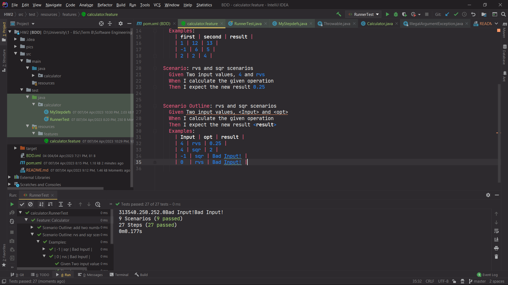

# SE-Lab-Exp2
### Student Numbers:
- Alireza Honarvar - 98102551
- Ali Najibi - 98106123

## About the project:
This project is about learning BDD (Behavior Driven Design).

## Report:
### 1.1. Reading the example doc and implementing it on our own.

### 1.2. Run test and show BUILD SUCCESS.

### 1.3. Creating necessary directories, packages, and files.

### 1.4. Adding MyStepdefs and Calculator.java and running test after updating maven.

### 2.1. Running the last scenario outline to see undefined results like the doc.
As you can see here in the left panel, we reach undefined for `-1 + 6 = 5`.
The rest test cases get completed successfully. 
So now we want to check MyStepdefs to see if we can handle negative numbers.

### 2.2. Changing `(\\d+)` to `(-?\\d+)`. 
We see the regex is `(\\d+)`, so it won't catch the negative sign.
We change it to `(-?\\d+)`, so it catches the negative sign too.

### 2.3. Matching the rest of the regexps.
We change the other regexps, so they catch the negative sign as well, and don't limit it to only the first number.

### 3.1. Implementing rvs and sqr: Scenarios.

### 3.2. Implementing rvs and sqr: Calculator.

### 3.3. Implementing rvs and sqr: MyStepdefs.
